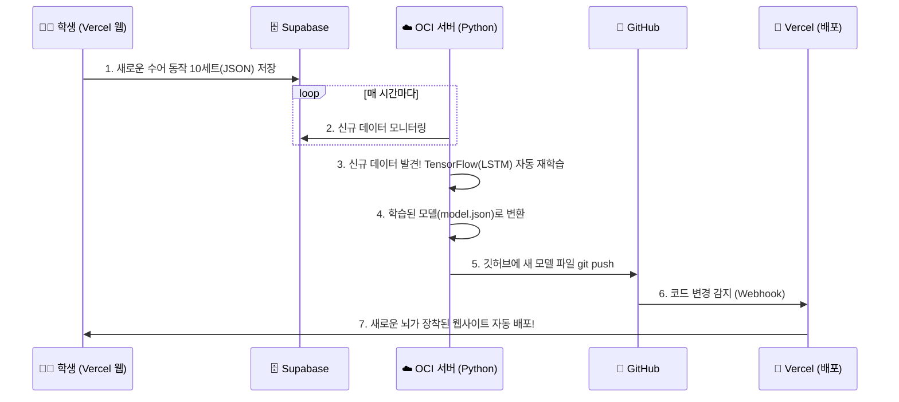

# 🚀 AI 수어 연구소 - MLOps 전체 아키텍처 및 구현 계획서

본 문서는 학생들이 수집한 수어 데이터를 자동으로 학습하고, 실시간으로 수어를 인식해 음성(TTS)으로 읽어주는 **'전자동 인공지능 파이프라인(MLOps)'**의 전체 설계도입니다.

---

## 1. 시스템 아키텍처 개요 (하이브리드 모노레포)

하나의 GitHub 저장소(Repository)에 모든 코드를 담아두고, 역할에 따라 구동되는 환경을 완벽하게 분리합니다.

### 📁 디렉토리 구조 (Monorepo)
```text
📁 hand (전체 프로젝트 폴더)
 ├── 📁 src (Vercel 배포용 프론트엔드)
 │    ├── 📁 pages (화면 단위 컴포넌트)
 │    │    ├── 📄 CollectionPage.jsx (1. 수집 페이지)
 │    │    ├── 📄 AdminPage.jsx (2. 관리자 대시보드)
 │    │    └── 📄 PracticePage.jsx (4. 실전 인식 및 TTS 페이지 - 예정)
 │    └── 📁 components (카메라 등 재사용 부품)
 └── 📁 ai_bot (OCI 서버용 백엔드)
      ├── 📄 train_bot.py (3. 자동 학습 파이썬 봇)
      └── 📄 requirements.txt
```

### 🌐 프론트엔드 (웹페이지) -> `Vercel` 호스팅
브라우저 카메라(`getUserMedia`) 구동을 위한 필수 조건인 **HTTPS 보안 연결**을 무료로 제공하는 Vercel을 사용합니다.
1. **데이터 수집 페이지**: 카메라를 켜고 30프레임의 관절 좌표를 Supabase에 저장 (완료)
2. **관리자 대시보드**: 수집된 데이터(JSON)를 Canvas 실루엣 애니메이션으로 렌더링하여 확인 (완료)
3. **실전 인식 및 TTS 페이지**: 실시간으로 카메라를 보고 AI가 수어를 예측한 뒤, 정답을 음성으로 읽어주는 서비스 (구현 예정)

### 🤖 백엔드 & AI 훈련소 -> `OCI 가상 서버 (Oracle Cloud)`
Vercel은 딥러닝 학습 같은 무거운 백그라운 작업을 할 수 없으므로, 선생님의 OCI 서버를 'AI 훈련소'로 사용합니다.
- 24시간 켜져 있는 OCI 서버에서 **파이썬 학습 봇(`train_bot.py`)**이 백그라운드로 계속 돌아갑니다.
- 텐서플로우(TensorFlow) 기반의 **LSTM 모델**을 사용하여 빠르고 가볍게 시계열 데이터(30프레임)를 학습합니다.

---

## 2. ♾️ 완벽한 MLOps 자동화 파이프라인 (작동 흐름)

선생님의 개입 없이 시스템이 스스로 진화하는 **Continuous Training (CT)** 흐름입니다.



1. **데이터 적재**: 학생들이 Vercel 웹에서 수어를 모으면 Supabase에 차곡차곡 쌓입니다.
2. **감지 및 다운로드**: OCI 서버의 봇이 "새로운 데이터가 모였다!"고 판단하면 데이터를 싹 받아옵니다.
3. **자동 훈련**: 파이썬이 OCI 서버의 CPU를 사용해 수분 내에 텐서플로우 학습을 완료합니다.
4. **결과물 Push**: 똑똑해진 새로운 AI 파일(`model.json`, `weights.bin`)을 서버가 스스로 GitHub에 업로드(Push) 합니다.
5. **자동 배포**: GitHub에 새 모델이 올라오는 순간, Vercel이 이를 감지하여 웹사이트를 재부팅하고 즉시 전 세계에 업데이트합니다.

---

## 3. 향후 개발 스텝 (Action Plan)

현재 Phase 2(데이터 수집)가 완료되었으므로 다음과 같은 순서로 진행됩니다.

### Step 1: 자동 학습 파이썬 봇 제작 (진행 예정)
- OCI 서버에서 구동될 `train_bot.py` 작성
- Supabase 다운로드 스크립트 + 데이터 전처리(Zero-padding) + LSTM 훈련 코드 결합
- 훈련 결과를 TensorFlow.js 포맷으로 변환하는 코드 추가

### Step 2: 실전 인식 페이지 및 TTS 개발
- React(Vercel)에 카메라를 켜고 실시간으로 `model.json`을 불러와 동작을 예측하는 기능 추가
- 예측률이 특정 수치(예: 80%)를 넘으면 정답을 화면에 띄우고, 브라우저 내장 Web Speech API를 이용해 음성(TTS)으로 읽어주는 로직 구현

### Step 3: OCI 서버 환경 세팅 및 Git 연동
- OCI 가상 서버에 접속하여 파이썬 가상환경(venv) 및 라이브러리 세팅
- 깃허브 SSH Key를 등록하여 파이썬 봇이 깃허브에 코드를 `push` 할 수 있도록 권한 부여
- 무중단 실행(`pm2` 또는 `systemd` 또는 `cron`) 적용
